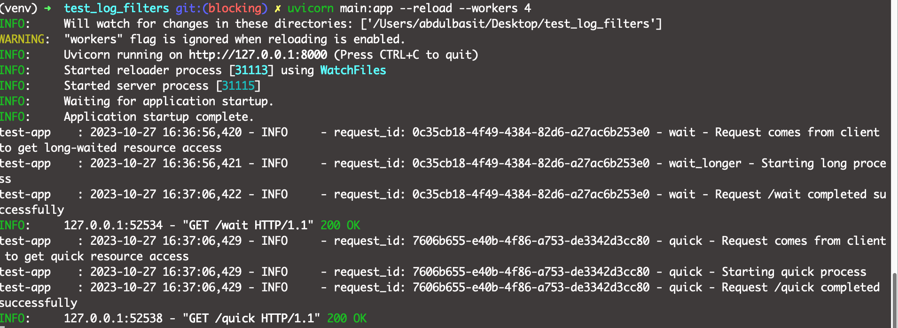

# FastAPI_centralized_logging
Learn how to do centralized logging in FastAPI framework

## Problem with this code
In this branch code, we face blocking nature of api /wait call. It's due to time.sleep.
Once /wait return the response then /quick api accept and return the response.

But both have separate request_id's in log messages. Which is good thing.

