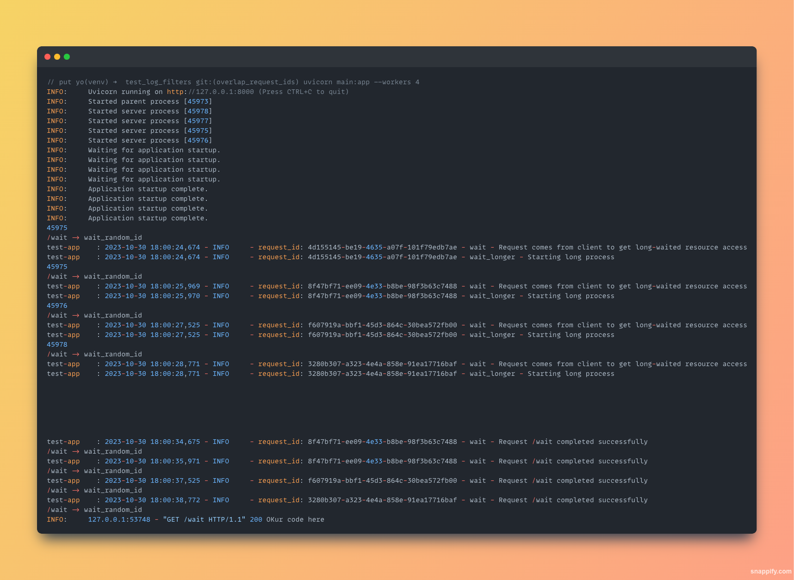

# FastAPI_centralized_logging
Learn how to do centralized logging in FastAPI framework

# How to run
- `uvicorn main:app --workers 4`

## Problem with this code
Once we called four /wait api at the same time with few seconds of difference, we observe request_id in log message are overlap in those messages which are logged after waited_longer function

