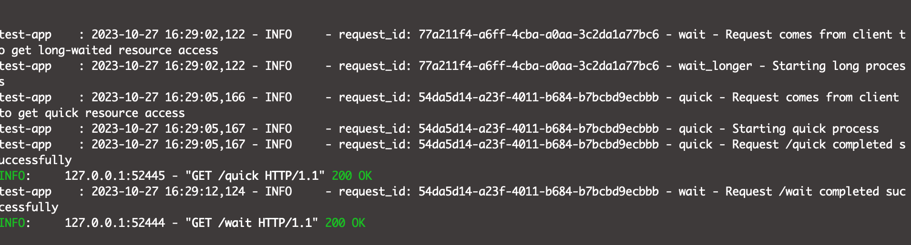

# FastAPI_centralized_logging
Learn how to do centralized logging in FastAPI framework

## Problem with this code
Both API's are working fine but due to centralized logging where we set request_id
in log filter, we override request_id on long waited api from quick api call.

See below in the screenschot where the second last log meesage from /wait API comes later but their request_id override by /quick api request_id - `54da5d14-a23f-4011-b684-b7bcbd9ecbbb`, which is not expected. Instead, we expect request_id in second last log message is `77a211f4-a6ff-4cba-a0aa-3c2da1a77bc6` because is comes from /wait api call.

